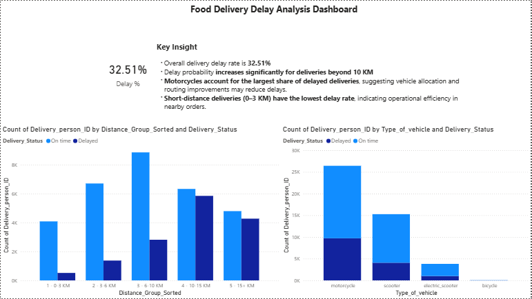

# Food Delivery Delay Analysis

## Project Overview
This project analyzes food delivery operations to identify factors contributing to delivery delays.  
The goal is to understand how delivery distance and vehicle type affect delivery performance and provide actionable business recommendations.

---

## Tools Used
- Excel
- Power BI
- Data Cleaning
- Pivot Tables
- Data Visualization

---

## Dataset Features

The dataset includes the following important fields:

- Delivery_person_ID
- Delivery_person_Age
- Delivery_person_Ratings
- Type_of_vehicle
- Delivery_Status
- Delivery_Distance(km)
- Distance_Group
- Time_taken(min)

---

## Key KPI

**Delay Rate**

Delay % = Delayed Orders / Total Orders

Result:

32.51% of deliveries are delayed.

---

## Key Insights

1. Delivery delays increase significantly for distances greater than **10 KM**.

2. **Motorcycles handle the highest number of deliveries and show the largest delay counts.**

3. Short-distance deliveries (**0–3 KM**) have the lowest delay rate.

---

## Dashboard

---

## Business Recommendations

- Optimize routing for long-distance deliveries.
- Improve vehicle allocation strategy.
- Monitor delivery delay rate regularly.

